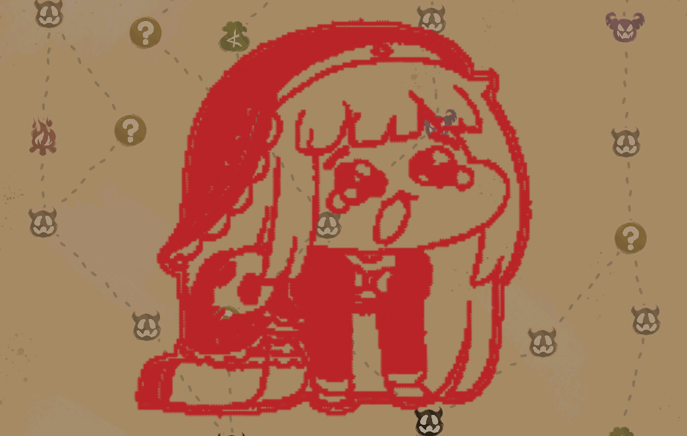

# StampTheSpire2

StampTheSpire2 is an image-based map stamping mod for Slay the Spire 2.

Instead of drawing every line by hand, you can open a stamp menu, choose the image you want, and place it directly on the map.

## Features

- Adds a stamp button to the map drawing toolbar
- Opens a stamp selection menu with right-click while stamp mode is active
- Automatically loads stamp entries from image files inside the `stamp_img` folder
- Supports stamp size cycling with `x1 -> x2 -> x3`
- Uses the game's normal map drawing flow, so the result behaves like a regular map drawing

## How To Use

1. Open the map screen.
2. Press the stamp button in the drawing toolbar.
3. While stamp mode is active, press the button again to change the size.
4. Right-click on the map to open the stamp selection menu.
5. Click the stamp you want to place.

## Stamp Images

The stamp menu is built from image files inside the `stamp_img` folder in the mod directory.
If you place your own images in that folder, the mod can turn them into in-game stamps.

Images with transparent backgrounds or clean solid-color backgrounds usually produce better results.

Supported extensions:

- `.png`
- `.jpg`
- `.jpeg`
- `.webp`

## Multiplayer

This mod does not add a separate protocol. It uses the game's existing map drawing flow.
Because of that, multiplayer is still possible even if the other player does not have this mod installed.

## Notes

- The stamped result is not pasted as the original image itself. The image is converted into map drawing strokes and then drawn on the map.
- If you use third-party characters, logos, fan art, or commercial images, it is recommended to check the copyright and usage terms before distributing them.

# StampTheSpire2

Slay the Spire 2의 맵 화면에서 이미지 기반 스탬프를 찍을 수 있게 해주는 모드입니다.

직접 선을 하나하나 그리지 않고, 스탬프 메뉴를 열고 원하는 이미지를 선택해서 맵 위에 바로 찍어 낼 수 있습니다.

## 주요 기능

- 맵 드로잉 툴바에 스탬프 버튼 추가
- 스탬프 모드 활성화 상태에서 우클릭으로 스탬프 선택 메뉴 열기
- `stamp_img` 폴더의 이미지 파일을 자동으로 읽어서 스탬프 목록 구성
- 스탬프 크기 `x1 -> x2 -> x3` 순환 지원
- 게임의 기본 맵 드로잉 흐름을 사용하므로 결과가 일반 맵 낙서처럼 동작

## 사용 방법

1. 맵 화면을 엽니다.
2. 드로잉 툴바의 스탬프 버튼을 누릅니다.
3. 스탬프 모드가 켜진 상태에서 버튼을 다시 누르면 크기가 바뀝니다.
4. 맵 위에서 우클릭하면 스탬프 선택 메뉴가 열립니다.
5. 원하는 스탬프를 클릭하면 해당 위치에 찍힙니다.

## 스탬프 이미지

스탬프 메뉴는 모드 폴더 안의 `stamp_img` 폴더 안의 이미지 파일을 기준으로 만들어집니다.
해당 폴더에 원하는 이미지를 넣으면 게임 내에서 스탬프를 만들수 있습니다.

배경이 투명하거나 깔끔한 단색 배경인 이미지일수록 결과가 더 자연스럽게 나오는 편입니다.

지원 확장자:

- `.png`
- `.jpg`
- `.jpeg`
- `.webp`

## 멀티플레이

이 모드는 별도의 프로토콜을 추가하지 않고, 게임의 기존 맵 드로잉 흐름을 사용합니다.
따라서 다른 플레이어와 멀티플레이를 할때에 다른 플레이어가 반드시 이 모드를 사용하지 않아도 플레이가 가능합니다.

## 주의사항

- 스탬프 결과는 원본 이미지를 그대로 붙이는 방식이 아니라, 이미지 형태를 맵 드로잉 선분으로 변환해서 그리는 방식입니다.
- 제3자의 캐릭터, 로고, 팬아트, 상업 이미지 등을 사용할 경우 배포 전 저작권과 사용 조건을 직접 확인하는 것을 권장합니다.
